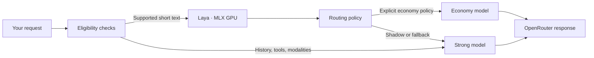

<p align="center">
  <picture>
    <source media="(prefers-color-scheme: dark)" srcset="docs/assets/wordmark-dark.png">
    
  </picture>
</p>

<p align="center">
  <a href="https://github.com/AmRitJain0442/tern/actions/workflows/check.yml"></a>
  
  
</p>

<p align="center">
  <a href="#try-it-in-a-minute">Quickstart</a> ·
  <a href="docs/quickstart.md">CLI guide</a> ·
  <a href="docs/adapter.md">Python API</a> ·
  <a href="docs/findings.md">Benchmarks</a> ·
  <a href="CONTRIBUTING.md">Contributing</a>
</p>

# Tern

**Small router. Clear decisions.**

Tern uses [Laya-MLX](https://huggingface.co/aac6fef/laya-mlx) to help choose between economy and strong models, then sends your request through OpenRouter. It combines capability checks, conservative fallback, and an async Python adapter that preserves messages, tool calls, streaming chunks, and usage.

Start with the free offline demo. Connect your private GPU endpoint when you're ready.

## Try it in a minute

Requires [uv](https://docs.astral.sh/uv/getting-started/installation/) and Git. The repository currently requires collaborator access.

```sh
git clone https://github.com/AmRitJain0442/tern.git
cd tern
uv sync --extra cli --python 3.12
uv run tern demo
```

**100 requests. No API key. No GPU. No network calls in the demo.** Installation downloads Python packages; the demo itself runs locally through the real adapter with synthetic model responses. It covers 25 distinct prompts each for rewrites, coding, tool requests, and classifier outages.

Use `uv run tern demo --all` to see every request, or `uv run tern demo --json` to export all results. The default view summarizes the 100 completed requests.


<sub>Captured from the CLI. Demo scores are illustrative, not benchmark results. [Text transcript](docs/assets/terminal-demo.txt).</sub>

## Connect your models

```sh
uv run tern init
# Add your OpenRouter key to .env. Existing values are never overwritten.
gcloud auth login
uv run tern doctor --live
uv run tern chat "Explain idempotency in two sentences." --stream
```

The CLI reads `.env` automatically. Live use needs an OpenRouter key and Cloud Run invoker access to the configured Laya service. The default endpoint is private; use your own `LAYA_ENDPOINT` if you are deploying separately. `doctor --live` checks access and wakes the GPU without buying an LLM completion. Live GPU use and `chat` can incur charges.


<sub>The screenshot shows local checks. Add `--live` to verify the key, model catalog and GPU readiness. [Text transcript](docs/assets/terminal-doctor.txt).</sub>

The GPU service runs in **shadow mode**, so live requests default to the strong model. To explicitly try economy routing:

```sh
uv run tern chat "Rewrite politely: send the report." --experimental-threshold 0.7
```

That threshold is an experiment, not a quality guarantee. [Full setup and troubleshooting →](docs/quickstart.md)

## Built for the request that actually arrived

| Capability | What you get |
|:--|:--|
| **GPU decisions** | Laya inference on MLX, hosted on a private GCP L4 service |
| **Explicit eligibility** | Model capabilities, context budgets, output limits and allowlists checked before dispatch |
| **Conservative fallback** | Classifier deadlines and a circuit breaker; at most one economy-to-strong retry for explicit retryable failures |
| **Streaming intact** | Async SSE, tool-call deltas, usage and finish reasons; no replay after output starts |
| **A visible decision** | Selected model, reason, score, policy version and attempted models in the Python result |
| **A small local footprint** | Use the adapter from a laptop or server; MLX stays on the GPU host |

## How it works



Private-processing and region-bound requests are rejected unless an appropriate integration is configured. A label probability is not the probability that an LLM will answer correctly. [Policy and failure behavior →](docs/adapter.md#selection-and-fallback-behavior)

## Measured, with the boundaries attached

| Recorded measurement | Result |
|:--|--:|
| MLX FP16 on Cloud Run L4 · median model inference, 60 samples | **9.47 ms** |
| Same run · median client HTTP latency | **101.23 ms** |
| Same run · client p95, all samples | **280 ms** |
| Four live OpenRouter adapter smoke requests · reported generation cost | **$0.0222** |

These are small feasibility probes, not production SLAs or savings claims. Startup took tens of seconds. GPU and networking costs are excluded from the OpenRouter figure; two Pro smoke answers were truncated by their token limit. Thresholds still need workload-specific quality calibration.

[Benchmark methodology](docs/findings.md) · [Raw GPU results](artifacts/cloud-mlx-gpu.json) · [Live adapter results](artifacts/openrouter-adapter-smoke.json)

## Go deeper

| I want to… | Start here |
|:--|:--|
| Run the CLI and fix setup issues | [Quickstart](docs/quickstart.md) |
| Integrate completions or streaming in Python | [Adapter guide](docs/adapter.md) · [Runnable streaming example](examples/stream.py) |
| Deploy the private GPU service | [GPU operations](docs/operations.md#gpu-experiment) |
| Understand routing tradeoffs | [Research](docs/research.md) · [Design](docs/design.md) |
| Evaluate chat, coding or business traffic | [Workloads](docs/workloads.md) · [Paired evaluations](docs/evaluation-data.md) |
| Contribute a fix or improve the docs | [Contributing](CONTRIBUTING.md) · [Security](SECURITY.md) |
| Reuse or regenerate project graphics | [Brand assets](docs/branding.md) |

## Development

```sh
uv sync --extra dev --extra cli --python 3.12
uv run pytest -q
uv run ruff check src tests scripts examples
```

Tests run without cloud credentials or inference hardware. CI checks every push and pull request. Live tests are explicit and separate. Project code is under [`src/model_router`](src/model_router); [issues](https://github.com/AmRitJain0442/tern/issues) and focused pull requests are welcome from collaborators.

---

<p align="center">
  <br>
  <sub>Built with <a href="https://github.com/mizorewww/laya-mlx">Laya-MLX</a>, <a href="https://github.com/ml-explore/mlx">MLX</a> and <a href="https://openrouter.ai">OpenRouter</a>.</sub>
</p>
