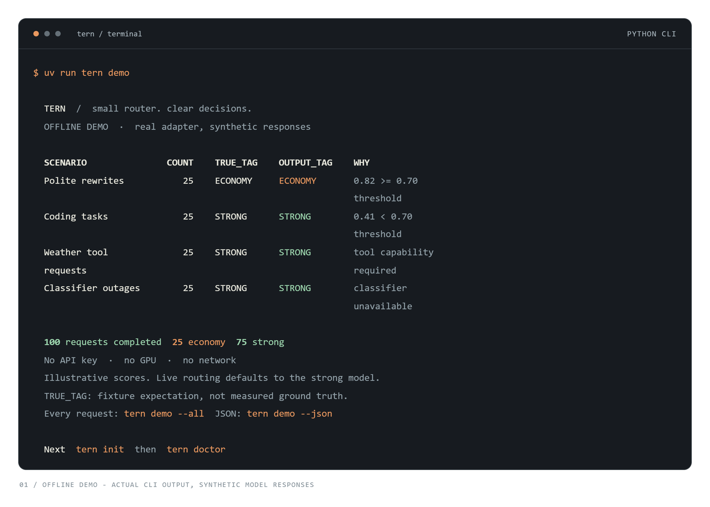
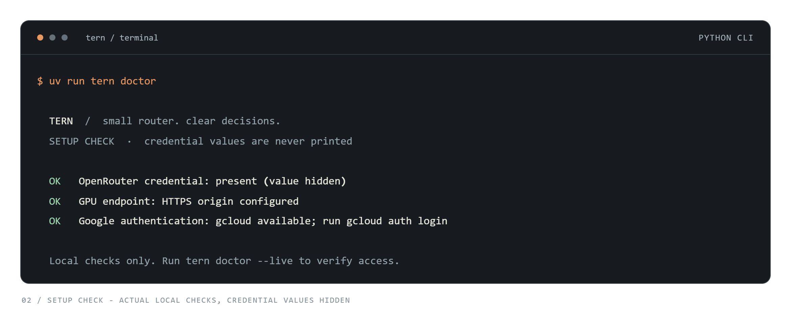
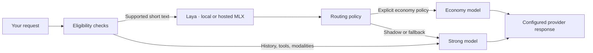

<p align="center">
  <picture>
    <source media="(prefers-color-scheme: dark)" srcset="docs/assets/wordmark-dark.png">
    
  </picture>
</p>

<p align="center">
  <a href="https://github.com/AmRitJain0442/tern/actions/workflows/check.yml"></a>
  <a href="LICENSE"></a>
  
  
</p>

<p align="center">
  <a href="#start-locally">Quickstart</a> ·
  <a href="docs/quickstart.md">CLI guide</a> ·
  <a href="docs/adapter.md">Python API</a> ·
  <a href="docs/providers.md">HTTP API & providers</a> ·
  <a href="docs/findings.md">Benchmarks</a> ·
  <a href="CONTRIBUTING.md">Contributing</a>
</p>

# Tern

**Small router. Clear decisions.**

Tern uses [Laya-MLX](https://huggingface.co/aac6fef/laya-mlx) to help choose between economy and strong models, then sends your request to configurable providers. It combines capability checks, conservative fallback, a Chat Completions API, and an async Python adapter that preserves messages, tool calls, streaming chunks, and usage.

Run real Laya locally with one setup command. No GCP account or API key is needed for classification.

## Start locally

Requires Git and a running Docker installation with Compose 2.24 or later.

```sh
git clone https://github.com/AmRitJain0442/tern.git
cd tern
docker compose up --build --wait
```

With [Docker Desktop](https://docs.docker.com/desktop/) or Docker Engine + Compose installed and running, that one command installs Python, MLX and Tern inside a container, downloads the pinned Laya checkpoint, and starts the local service. It returns when model loading and a real inference check succeed. The default uses your CPU and persists weights across restarts. Initial setup requires internet and several GB of disk/RAM; no separate Python, CUDA or cloud setup is needed.

**Make a real local decision:**

```sh
docker compose exec laya tern route "Rewrite politely: send the report."
```

This returns actual Laya probabilities. The default shadow policy still selects the strong tier; the classifier proposal is reported separately. No downstream LLM is called.

Verified on Windows with Docker's Linux CPU runtime, including a restart and real inference with networking disabled. [Recorded local check](artifacts/local-setup-smoke.json). CPU inference took about 23 seconds on that machine; use Metal or supported NVIDIA hardware for faster local routing.

**Apple Silicon:** use native Metal instead of an emulated Docker CPU:

```sh
uv run --python 3.12 --extra cli --extra mlx-metal tern serve
```

With [uv](https://docs.astral.sh/uv/getting-started/installation/) and Git installed, this installs the runtime, downloads Laya on first load, and starts a local Metal service. Keep that terminal open. See [platform requirements, optional NVIDIA acceleration and cloud hosting](docs/quickstart.md).

**Want the synthetic preview instead?** `docker compose exec laya tern demo` runs 100 fixture requests through the real adapter with synthetic scores and responses. It covers rewrites, coding, tool requests and classifier outages. It is separate from real local inference.

Add `--all` to the demo command to see every fixture, or `--json` to export its results. The screenshot below shows this synthetic preview, not local model inference.



<sub>Captured from the CLI. Demo scores are illustrative, not benchmark results. [Text transcript](docs/assets/terminal-demo.txt).</sub>

## Connect your models

**Use Tern from your app:** base URL `http://127.0.0.1:8080/v1`, model `tern/auto`. The setup command also starts `/v1/chat/completions`, with streaming and optional `TERN_API_KEY` authentication. [API request examples and provider setup](docs/providers.md).

OpenRouter works by default. Use `TERN_CONFIG=config/providers.json` for other compatible endpoints, local model servers, or different providers per tier. Native vendor APIs can connect through a translation gateway such as LiteLLM. [Configuration examples and compatibility boundaries](docs/providers.md#platform-coverage).

```sh
# Add OPENROUTER_API_KEY=your-key to a .env file in this directory, then:
docker compose up --wait
docker compose exec laya tern doctor --live
docker compose exec laya tern chat "Explain idempotency in two sentences." --stream
```

Laya runs on your machine; OpenRouter generates the answer and charges for those generations. Compose reads the key from your shell or `.env`, and restarting with `up --wait` applies configuration changes. `doctor --live` checks local readiness and, when a key is present, OpenRouter access without buying a completion. GCP hosting is optional. The Python CLI also defaults to local Laya and preserves explicitly configured remote endpoints.

**Run 100 real requests** after setup:

```sh
docker compose exec laya tern demo --live --experimental-threshold 0.7
```

This makes paid OpenRouter calls using real Laya decisions for eligible text prompts. It covers 25 rewrites, 25 coding tasks, 25 tool-call requests, and 25 summaries, and saves every response and routing decision to a timestamped JSON file in `artifacts/`. Tool requests bypass classification; returned tool calls are validated but not executed. Output is capped at 2,048 tokens per attempt, with four concurrent generations. Omit the experimental threshold to follow the service's shadow policy. [Live-run details →](docs/quickstart.md#run-100-live-requests)

[Recorded live run](docs/live-results.md): **100/100 completions**, 65 Flash Lite / 35 Pro, **$0.1965** reported OpenRouter cost excluding GCP; three classifier fallbacks and one truncated answer.



<sub>The screenshot shows local configuration checks. Add `--live` to verify Laya readiness and optional OpenRouter access. [Text transcript](docs/assets/terminal-doctor.txt).</sub>

The service runs in **shadow mode**, so live requests default to the strong model. To explicitly try economy routing:

```sh
docker compose exec laya tern chat "Rewrite politely: send the report." --experimental-threshold 0.7
```

That threshold is an experiment, not a quality guarantee. [Full setup and troubleshooting →](docs/quickstart.md)

## Built for the request that actually arrived

| Capability | What you get |
|:--|:--|
| **Local decisions** | Real Laya inference on CPU, Apple Metal or NVIDIA CUDA; cloud hosting is optional |
| **Explicit eligibility** | Model capabilities, context budgets, output limits and allowlists checked before dispatch |
| **Conservative fallback** | Classifier deadlines and a circuit breaker; at most one economy-to-strong retry for explicit retryable failures |
| **Streaming intact** | Async SSE, tool-call deltas, usage and finish reasons; no replay after output starts |
| **A visible decision** | Selected model, reason, score, policy version and attempted models in the Python result |
| **One-command setup** | Runtime, pinned model download, persistent cache and readiness checks through Compose |

## How it works



Private-processing and region-bound requests are rejected unless an appropriate integration is configured. A label probability is not the probability that an LLM will answer correctly. [Policy and failure behavior →](docs/adapter.md#selection-and-fallback-behavior)

## Measured, with the boundaries attached

| Recorded measurement | Result |
|:--|--:|
| MLX FP16 on Cloud Run L4 · median model inference, 60 samples | **9.47 ms** |
| Same run · median client HTTP latency | **101.23 ms** |
| Same run · client p95, all samples | **280 ms** |
| Four live OpenRouter adapter smoke requests · reported generation cost | **$0.0222** |

These are small feasibility probes, not production SLAs or savings claims. Startup took tens of seconds. GPU and networking costs are excluded from the OpenRouter figure; two Pro smoke answers were truncated by their token limit. Thresholds still need workload-specific quality calibration.

[Benchmark methodology](docs/findings.md) · [Raw GPU results](artifacts/cloud-mlx-gpu.json) · [Live adapter results](artifacts/openrouter-adapter-smoke.json) · [Live HTTP API check](docs/providers.md#recorded-live-api-check)

## Go deeper

| I want to… | Start here |
|:--|:--|
| Run the CLI and fix setup issues | [Quickstart](docs/quickstart.md) |
| Connect my app or choose model providers | [HTTP API and provider configuration](docs/providers.md) |
| Integrate completions or streaming in Python | [Adapter guide](docs/adapter.md) · [Runnable streaming example](examples/stream.py) |
| Deploy the private GPU service | [GPU operations](docs/operations.md#gpu-experiment) |
| Understand routing tradeoffs | [Research](docs/research.md) · [Design](docs/design.md) |
| Evaluate chat, coding or business traffic | [Workloads](docs/workloads.md) · [Paired evaluations](docs/evaluation-data.md) |
| Contribute a fix or improve the docs | [Contributing](CONTRIBUTING.md) · [Security](SECURITY.md) |
| Reuse or regenerate project graphics | [Brand assets](docs/branding.md) |

## Development

```sh
uv sync --extra dev --extra cli --python 3.12
uv run pytest -q
uv run ruff check src tests scripts examples
```

Tests run without cloud credentials or inference hardware. CI checks every push and pull request. Live tests are explicit and separate. Project code is under [`src/model_router`](src/model_router); [issues](https://github.com/AmRitJain0442/tern/issues) and focused pull requests are welcome. See the [contributing guide](CONTRIBUTING.md) and [community conduct](CODE_OF_CONDUCT.md).

## License and acknowledgments

Tern's original code and documentation use the [MIT License](LICENSE). Laya's model and runtime retain their Apache-2.0 license; other dependencies retain their own terms. Setup downloads model files separately and preserves their notices. See [third-party attribution](THIRD_PARTY_NOTICES.md).

This is an experimental release. The documented clone-based setup is the supported installation path; a PyPI release is not implied. Provider compatibility follows the [documented Chat Completions subset](docs/providers.md#request-and-streaming-behavior), and only the recorded OpenRouter integrations have been live-verified.

---

<p align="center">
  <br>
  <sub>Built with <a href="https://github.com/mizorewww/laya-mlx">Laya-MLX</a>, <a href="https://github.com/ml-explore/mlx">MLX</a> and <a href="https://openrouter.ai">OpenRouter</a>.</sub>
</p>
