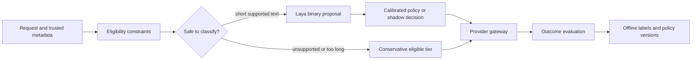

# Research notebook

Research date: 2026-09-23. Primary sources are linked next to claims. Recommendations and experiment designs below are our hypotheses, not published results.

## What Laya provides

Laya produces typed choices, ordinal scores, and boolean probabilities without generating answer text. The English, multilingual, and specialized checkpoints have different context budgets. Its built-in router chooses **Laya checkpoints**, not the best downstream LLM. Upstream also provides task/difficulty question presets, but task classification is not evidence of downstream quality. [Upstream code](https://github.com/NandhaKishorM/laya/tree/010bacef009c855ccba814b51f7c8e1d38ab5e3f).

Laya-MLX is an independent port. Its published Apple Silicon benchmarks and numerical agreement tests measure different things: runtime performance, port fidelity, and small labeled classification samples. None establishes cost savings for our LLM pool. [Port](https://github.com/mizorewww/laya-mlx/tree/0a859518634112655cb97c745dbf04f5191aaf13), [benchmark methodology](https://github.com/mizorewww/laya-mlx/blob/0a859518634112655cb97c745dbf04f5191aaf13/BENCHMARKS.md).

## Hosting finding

MLX itself now supports Linux CPU and NVIDIA CUDA, so “MLX can only run on a Mac” is outdated. Laya-MLX advertises Apple Silicon; its Linux portability still needs actual execution. Explicitly installing `mlx[cpu]` is necessary because the port's MLX dependency is conditional on macOS. CPU float32 is the first portability experiment; CUDA and float16 require separate validation. [Official MLX installation](https://ml-explore.github.io/mlx/build/html/install.html).

## Research questions

- Does one binary routing decision beat a task/difficulty questionnaire on held-out downstream outcomes?
- Does Laya outperform a cheap linear classifier on frozen embeddings at equal coverage?
- Is saved generation cost larger than classification, network, cold-start, and fallback costs?
- When do multilingual and long-conversation requests need a separate path?
- Can a learned residual policy improve on simply using the strongest affordable model?
- Does CPU quantization preserve routing decisions near the escalation threshold?

## External baselines

- **RouteLLM** learns strong/weak preferences. Its reported savings concern its tested pools and datasets, not this service. Use its matrix-factorization/BERT approach as a trained baseline. [Paper](https://arxiv.org/abs/2406.18665), [code](https://github.com/lm-sys/RouteLLM).
- **RouterBench** provides precomputed outcomes for offline cost/quality comparisons. Historical model pools limit its use as a production acceptance test. [Paper](https://arxiv.org/abs/2403.12031), [code](https://github.com/withmartian/routerbench).
- **LLMRouterBench** reports that several sophisticated routers fail to reliably beat simple baselines under unified evaluation. Include static and random routing in every experiment. [Paper](https://arxiv.org/abs/2601.07206).
- **Arch-Router** is an alternative for natural-language routing preferences, with a larger generative backbone and its own license. Benchmark only if configurable route descriptions matter. [Model card](https://huggingface.co/katanemo/Arch-Router-1.5B).

## Provisional architecture

The provider gateway must own retries, rate limits, health, streaming, and provider authentication. The classifier should own neither arbitrary URLs nor secrets. A decision endpoint can be benchmarked independently before connecting paid generation.

## Deployment intent

The user authorized `tribe-v2-host` and subsequently authorized GPU use. A CPU baseline was measured and removed; the private L4 prototype is now hosted in Singapore. It uses immutable model revisions, baked weights, and no downstream provider calls. Cloud Run L4 requires at least 4 vCPU / 16 GiB and instance-based billing; scale-to-zero does not eliminate warm idle cost. [GCP GPU configuration](https://docs.cloud.google.com/run/docs/configuring/services/gpu), [pricing](https://cloud.google.com/run/pricing).

See [measured findings](findings.md), [design and economics](design.md), and [the multi-workload plan](workloads.md) for the research conclusions and remaining experiments.
